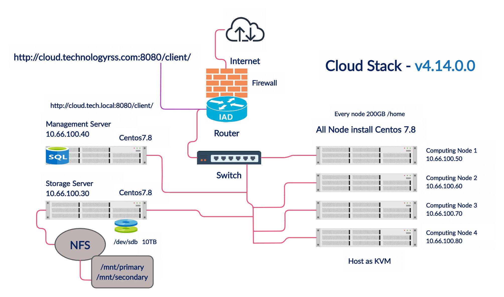

# Cloud Architecture



CloudStack is an open-source cloud computing software for creating, managing, and deploying infrastructure cloud services. It provides a comprehensive platform for building and managing public and private clouds. The architecture of CloudStack is designed to be modular and scalable, allowing it to support a wide range of use cases and deployment scenarios.

## Architecture Components

The CloudStack architecture consists of several key components:

1. **Management Server**: The central component of CloudStack, responsible for managing the overall cloud infrastructure. It handles tasks such as resource allocation, user management, and API requests.
2. **Database**: CloudStack uses a relational database to store information about the cloud infrastructure, including virtual machines, storage, and network configurations.
3. **Hypervisor**: CloudStack supports multiple hypervisors, including KVM, XenServer, and VMware. The hypervisor is responsible for creating and managing virtual machines on the physical servers.
4. **Agent**: The agent runs on each physical server and communicates with the management server to execute commands related to virtual machine management, such as starting, stopping, and migrating VMs.
5. **API**: CloudStack provides a RESTful API that allows users and applications to interact with the cloud infrastructure programmatically.
6. **User Interface**: CloudStack includes a web-based user interface that allows administrators and users to manage the cloud infrastructure visually.

## Prerequisites

- At least one computer with enabled hardware virtualization
- A minimal EL8 distro:
    - [Oracle Linux 8](https://yum.oracle.com/oracle-linux-isos.html)
    - [Rocky Linux 8](https://rockylinux.org/download)
    - [AlmaLinux OS 8](https://almalinux.org/get-almalinux/)
- A /24 network with static addressing (no DHCP)

## Installation and Configuration

### Step 1: System Update & Network Configuration

Upgrade system packages:
```bash
dnf -y upgrade
```

Configure network bridge:
```bash
nmcli connection add type bridge con-name cloudbr0 ifname cloudbr0
nmcli connection modify enp0s3 master cloudbr0
nmcli connection up enp0s3
nmcli connection modify cloudbr0 ipv4.addresses '172.16.10.2/24(Your IP address)' ipv4.gateway '172.16.10.1 (Your Gateway IP address)' ipv4.dns '8.8.8.8' ipv4.method manual && nmcli connection up cloudbr0
sudo dnf install net-tools -y
sudo reboot
```

### Step 2: Hostname Configuration

```bash
hostnamectl set-hostname server.local --static
reboot
```

### Step 3: SELinux Configuration

```bash
setenforce 0
```

Edit `/etc/selinux/config` and set `SELINUX=permissive`.

### Step 4: NTP Installation

```bash
dnf -y install chrony
systemctl enable chronyd
systemctl start chronyd
```

### Step 5: CloudStack Repository

Create `/etc/yum.repos.d/cloudstack.repo`:
```ini
[cloudstack]
name=cloudstack
baseurl=http://download.cloudstack.org/centos/$releasever/4.22/
enabled=1
gpgcheck=0
```

### Step 6: Firewall Configuration
disable the firewall, so that it will not block connections.

```bash
systemctl stop firewalld
systemctl disable firewalld
```

### Step 7: Database Installation

```bash
dnf search mysql
dnf -y install mysql8.4
dnf -y install mysql8.4-server
```

Edit `/etc/my.cnf.d/mysql-server.cnf` and add to `[mysqld]` section:
```ini
innodb_rollback_on_timeout=1
innodb_lock_wait_timeout=600
max_connections=350
log-bin=mysql-bin
binlog-format = 'ROW'
```

### Step 8: Enable MySQL

```bash
systemctl enable mysqld
systemctl start mysqld
```

### Step 9: CloudStack Management Server Installation 

```bash
dnf -y install cloudstack-management
```

### step 10: Initialize the CloudStack database and management server:
```bash
cloudstack-setup-databases cloud:password@localhost --deploy-as=root
cloudstack-setup-management
```

### Step 11: KVM Setup

```bash
dnf -y install cloudstack-agent
```

### Step 12: KVM Configuration

Edit `/etc/libvirt/qemu.conf`:
```ini
vnc_listen=0.0.0.0
```

Edit `/etc/libvirt/libvirtd.conf`:
```ini
listen_tls=0
listen_tcp=1
tcp_port=16509
auth_tcp=none
mdns_adv=0
```

the socket masking:

```bash
systemctl mask libvirtd.socket libvirtd-ro.socket libvirtd-admin.socket libvirtd-tls.socket libvirtd-tcp.socket
```
Restart libvirt:
```bash
systemctl restart libvirtd
lsmod | grep kvm
```
You should see something like this:
```bash
kvm_intel 55496 0
kvm 337772 1 kvm_intel
kvm_amd # if you are in AMD cpu
```
